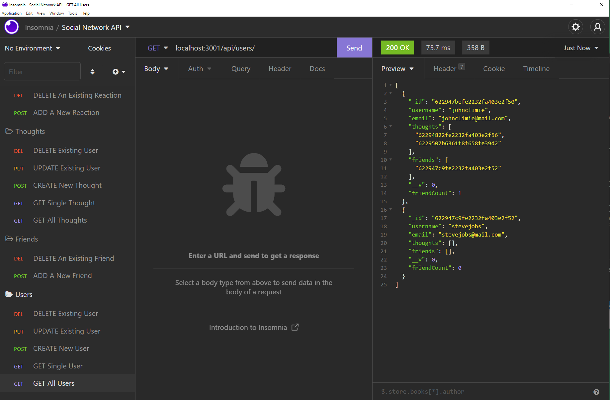

# Social Network API

## Description

In this project, I created a back-end Social Network API. This project was created with no source code, which required research on how to structure the files, along with the syntax of the NPMs. This project was created as a back-end project, therefore it's isn't accessible through a webpage.

In order to start this project, you will have to run this project through Node.js with `npm run start`. The user also is required to install MongoDB. Once the server is running, the user can create a new user with a username and email address. Once that is created, the user can create new thoughts, which one can think of as a tweet or a post. This requires content for the post, the username, and the user id for who is making the post. One user can make a reaction to a thought, which acts as a comment. This requires content and a username for the post. Users could also friend each other. 

A full demonstration is linked at the bottom of this README.

This project was created with the use of a new database which is new to me, that is MongoDB. Thankfully I already have experience in SQL. Therefore, I was able to have a firm grasp on how MongoDB works. This project also used Express.js and Node.js. Of course this project also used Javascript. In order to test the API, I used the applications Postman and Insomnia.

This project was a refreshing experience for me, as I got to learn about a new database. I find MongoDB easier to learn than SQL, along with the code written for it was far cleaner than the SQL comparison. I overall found this project very beneficial, fulfilling three out of four core components to learn MERN stack web development.

**Link**

YouTube Demonstration: https://youtu.be/TrdMQ_cjcEk